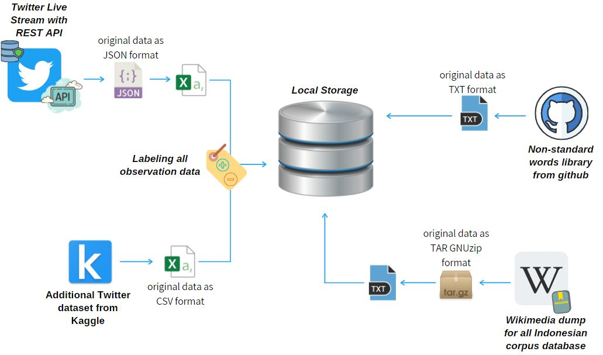
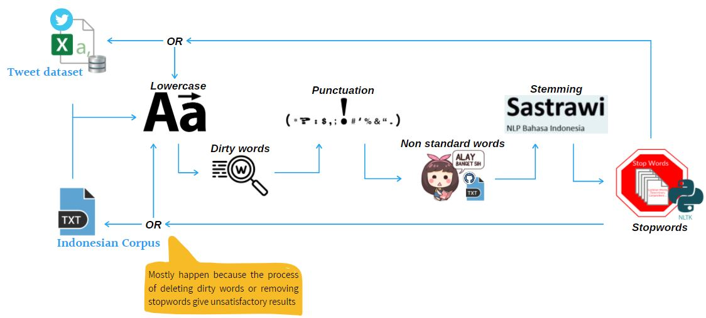
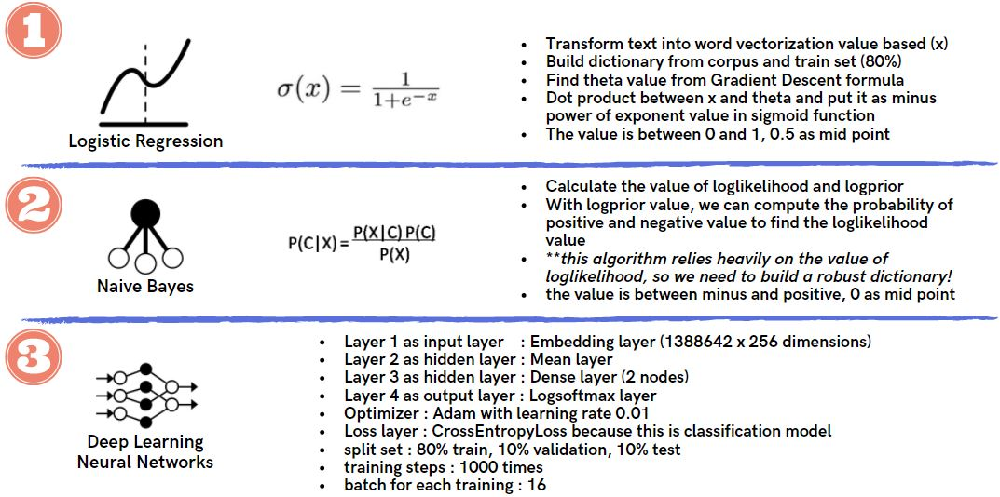
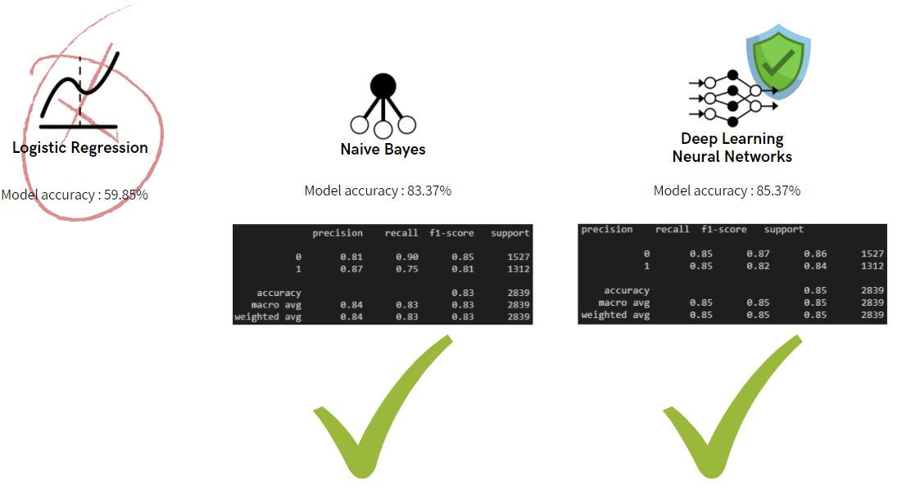

<!DOCTYPE html>
<html lang="en">
    <head>
        <meta charset="UTF-8">
        <meta name="viewport" content="width=device-width, initial-scale=1.0">
    </head>
    <body>
        <h1>TWITTER SENTIMENT ANALYSIS</h1>
         
        

            <h2>Background</h2>
            Businesses get customer feedback through multiple channels – both offline and online feedback. In fact, online feedback systems and platforms that, by design aggregate customer sentiment, are becoming dominant these days with social media platforms. Customers share their thoughts through Facebook likes, Twitter tweets, LinkedIn comments, Pinterest pins, and more
        

        

            <h2>Process Workflows</h2>
            
        

        

            <h2>ETL (Extract, Transform, Load)</h2>
            Data source:<ul>
                <li>Live stream Twitter API
                <li>https://github.com/keyreply/Bahasa-Indo-NLP-Dataset
                <li>https://www.kaggle.com/ilhamfp31/indonesian-abusive-and-hate-speech-twitter-text
                <li>Indonesia Corpus https://dumps.wikimedia.org/idwiki/latest/ (idwiki-latest-pages-articles.xml.bz2)
            </ul>
            
        

        

            <h2>Text Cleaning (DC-DP)</h2>
            
        

        

            <h2>Modeling</h2>
            
        

        

            <h2>Result</h2>
            
        

        

            <h2>Conclusion</h2>
            <ul>
                <li>Natural Language Processing (NLP) is a hotbed of research in data science these days and one of the most common applications of NLP is sentiment analysis
                <li>From opinion polls to creating entire marketing strategies, this domain has completely reshaped the way businesses work
                <li>Thousands of text documents can be processed for sentiment in seconds, compared to the hours it would take a team of people to manually complete the same task
            </ul>
        

        

            <h2>Future Works</h2>
            <ul>
                <li>Indonesia has so many sub-languages and this is a big homework to build a corpus that can provide all of it for mapping every each word that has common similarity with other words
                <li>When we talk about N-grams bag of words, sometimes stopwords can be meaningful
                <li>Misspelling is the most common issue for Bahasa especially in social media, that's why we need to build a large library that can manage every word so stemming words can be an easy task
                <li>Satire, this is so painful work that our model can't distinguish the meaning of sentences
                <li>Word2Vec and GloVe as the recommend algorithms to build a robust word embedding model
            </ul>
        

        

            <h2>Webapps Display (in mobile device resolution example)</h2>
            
        

</html>