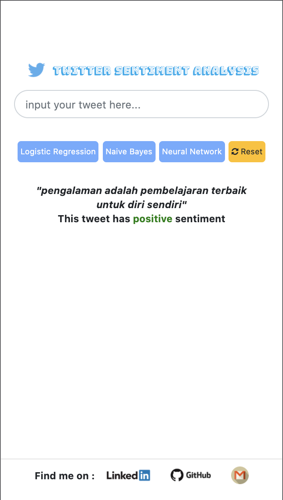

<h1>TWITTER SENTIMENT ANALYSIS</h1>

  

In this project, the author built the model with 3 approaches to define the sentiment of a tweet:<ol>
    <li>Logistic Regression (Sigmoid function)
    <li>Naive Bayes Theorem (with 2 parameters : Logprior and Loglikelihood)
    <li>Neural Networks (4 layers : Embedding layer, Mean layer, Dense layer and Logsoftmax layer)
</ol>

 

Data source:<ul>
    <li>Live stream Twitter API
    <li>https://github.com/keyreply/Bahasa-Indo-NLP-Dataset
    <li>https://www.kaggle.com/ilhamfp31/indonesian-abusive-and-hate-speech-twitter-text
    <li>Indonesia Corpus https://dumps.wikimedia.org/idwiki/latest/ (idwiki-latest-pages-articles.xml.bz2)
</ul>

